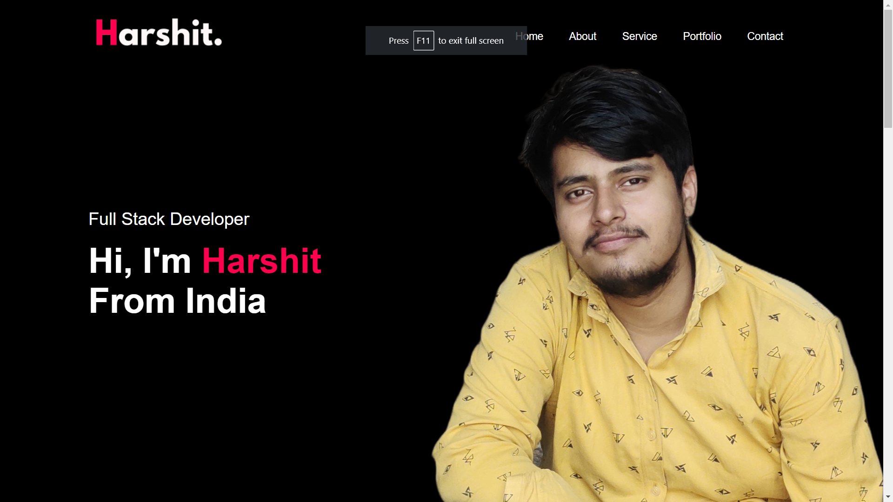
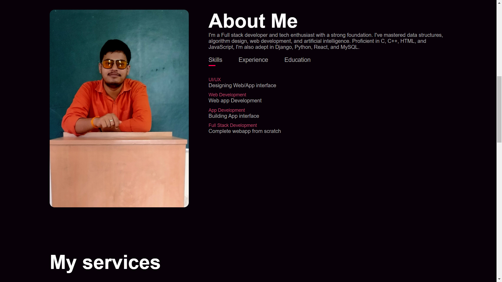
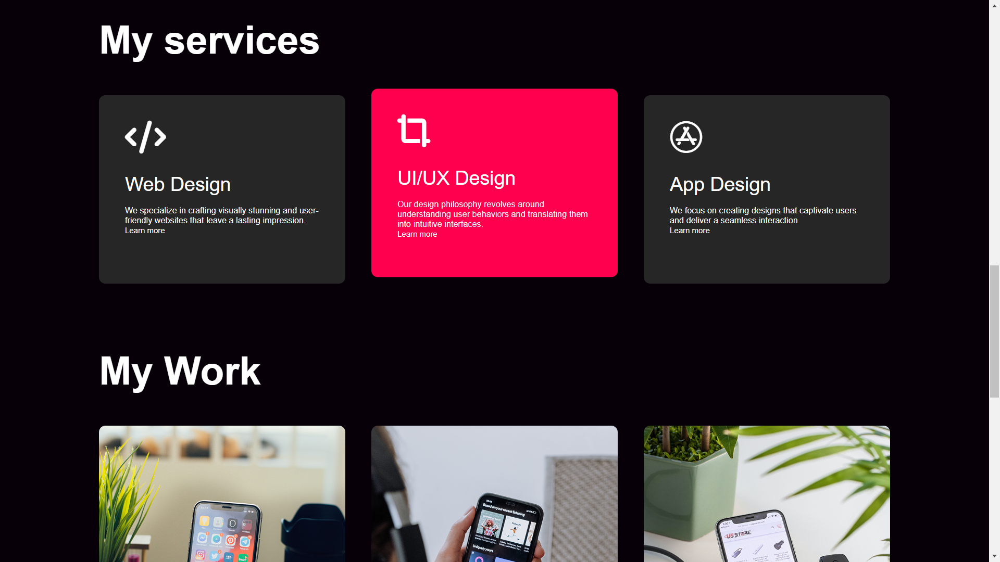
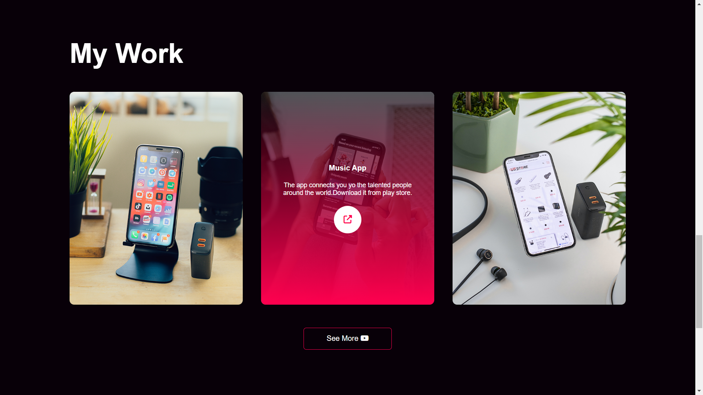
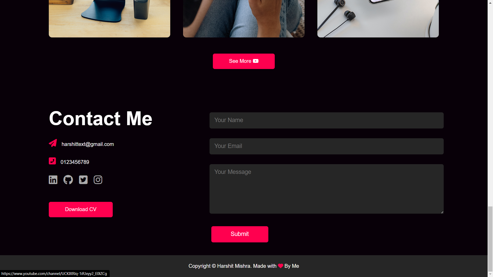
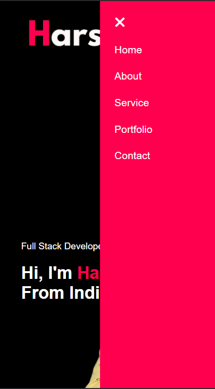

# Personal Portfolio Readme

## Overview

This repository contains the code for a personal portfolio website designed and developed by Harshit Mishra. The portfolio showcases Harshit's skills, experience, services, and projects. The website is responsive and provides a seamless experience across different devices.

## Screenshots






<table>
  <tr>
    <td></td>
    <td></td>
  </tr>
</table>
## Features

1. **Responsive Design:** The website is designed to be responsive, ensuring a consistent user experience on various devices, including desktops, tablets, and mobile phones.

2. **Navigation:** The navigation menu allows users to easily navigate through different sections of the website. The menu includes links to the home, about, services, portfolio, and contact sections.

3. **About Me Section:** The "About Me" section provides information about Harshit Mishra, highlighting skills, experiences, and education. It includes tabs for displaying skills, experience, and education details.

4. **Services Section:** The "Services" section outlines the services offered by Harshit, including web design, UI/UX design, and app design. Each service has a brief description and a "Learn more" link.

5. **Portfolio Section:** The "Portfolio" section showcases Harshit's work with project images and descriptions. Users can view more details by clicking on the external link icon.

6. **Contact Section:** The "Contact" section displays contact information, social media links, and a form for users to send messages. The form data is submitted to a Google Sheet.

7. **Download CV Button:** Users can download Harshit's CV by clicking the "Download CV" button.

## Usage

1. Clone the repository:

   ```bash
   git clone https://github.com/username/repo.git
   ```

2. Open the `index.html` file in a web browser.

3. Explore the different sections of the portfolio.

4. Use the navigation menu to switch between sections.

5. Fill out the contact form to send a message.

## Credits

- Icons: [Font Awesome](https://fontawesome.com/)
- Google Sheet Integration: [Google Apps Script](https://developers.google.com/apps-script/guides/web)

## License

This project is licensed under the MIT License - see the [LICENSE](LICENSE) file for details.

